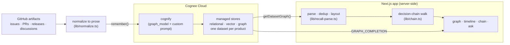

# Deconstructed

*Reconstruct how a product evolved — from its public artifacts.*

Deconstructed turns a product's GitHub history — issues, discussions, pull
requests, releases — into a typed **knowledge graph in [Cognee Cloud](https://www.cognee.ai)**,
then reconstructs the **decision chain** behind any part of it: the problem
that raised it, the feature it concerns, the pull request that implemented it,
the release that shipped it.

Three independent products — [Vercel AI SDK](https://github.com/vercel/ai),
[Cal.com](https://github.com/calcom/cal.com) and
[Plane](https://github.com/makeplane/plane) — share one `Product`-rooted
ontology, so the same engine reconstructs all three with no per-product code.

## Why

A README tells you *what* a feature is. Git history tells you *when* it
changed. Neither tells you *why* it exists — the problem that prompted it, the
discussion that shaped it, what it replaced. That reasoning is scattered
across hundreds of issues, PRs and releases. Deconstructed connects those
artifacts into a graph and reads the chain of evidence back as an answer.

## How it works

1. **Pull** public GitHub artifacts and normalize each to prose that states
   its relationships in plain sentences (`lib/normalize.ts`).
2. **Remember** the prose into a Cognee Cloud dataset with a `graph_model`
   (JSON Schema) and a custom extraction prompt. Cognee's *cognify* step
   extracts **typed** entities (`Issue`, `PullRequest`, `Release`, `Feature`,
   `Contributor`) and **typed** edges (`resolves_issues`, `implements_feature`,
   `includes_pull_requests`, `concerns_feature`, …) — not generic text chunks.
3. **Read** the dataset graph back, drop Cognee's housekeeping nodes, merge
   cross-batch duplicates, and lay it out server-side.
4. **Explore** it three ways over one dataset: a force-directed **graph**, a
   time-sorted **timeline**, and a **decision chain** that walks the typed
   evolution spine from any node. **Ask** a natural-language question and
   Cognee answers with `GRAPH_COMPLETION` over the same graph.

## Architecture



The app owns traversal and rendering; **Cognee owns extraction and storage.**
Every Cognee call happens in a server-side Route Handler or script — the API
key never reaches the browser.

## Why Cognee Cloud

- **Typed graph in one hosted call.** `graph_model` + custom prompt make
  cognify extract *your* ontology, so the graph is a real decision graph, not
  a bag of document chunks. No local pipeline to wire up.
- **One dataset per product, one schema.** Managed multi-dataset isolation is
  what lets three products share an ontology and still be queried
  independently or together.
- **`GRAPH_COMPLETION`.** Hybrid graph + vector retrieval answers *why/how*
  questions over the connected artifacts, not a single document.

## Stack

Next.js (App Router) + TypeScript · [Sigma.js](https://www.sigmajs.org/) +
[graphology](https://graphology.github.io/) for the graph · Cognee Cloud for
memory · Vitest for the pure-function tests.

## Products

| Product | Repo | Domain |
| --- | --- | --- |
| Vercel AI SDK | `vercel/ai` | AI application toolkit |
| Cal.com | `calcom/cal.com` | scheduling infrastructure |
| Plane | `makeplane/plane` | project management |

## Setup

```bash
npm install
cp .env.example .env      # add COGNEE_API_KEY (+ GITHUB_TOKEN recommended)
npm run ingest            # ingest all three (or: npm run ingest -- plane)
npm run dev
```

The UI renders live graph data only — nothing is mocked. A product that
hasn't been ingested yet shows a designed setup state, not a crash.

Optional: `npx tsx scripts/validate-cognee.ts` smoke-tests the live API
(remember, recall, getDatasetGraph) against a throwaway dataset.

## Test

```bash
npm test
```

## Attribution

Built on public GitHub artifacts from
[vercel/ai](https://github.com/vercel/ai),
[calcom/cal.com](https://github.com/calcom/cal.com) and
[makeplane/plane](https://github.com/makeplane/plane) — analyzed and
connected, never republished. Memory by [Cognee Cloud](https://www.cognee.ai).
